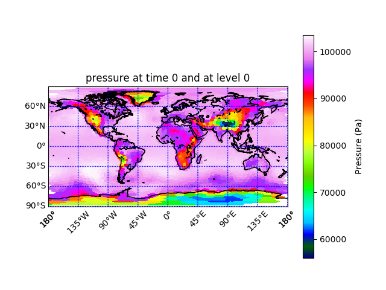

Latitude and Longitude Plotting
===============================

A more standard and natural way of plotting. Plotting against latitude and
longitude is much quicker then creating the polygon patch collection to plot
individual MPAS grid polygons. 

While this example focuses on a MPAS grid and output files that have been
interpolated to a latitude, longitude grid, there is no reason that this
example would not work for other models that produce gridded output.

To convert an MPAS output to a lat, lon grid use the `convert_mpas`
utility which can be found here:

[https://github.com/mgduda/convert_mpas](https://github.com/mgduda/convert_mpas)

If you have problems compiling `convert_mpas` for your system, please check
section 2.4 in the MPAS tutorial, which can be found here:

[http://www2.mmm.ucar.edu/projects/mpas/tutorial/Boulder2018/index.html](http://www2.mmm.ucar.edu/projects/mpas/tutorial/Boulder2018/index.html)

